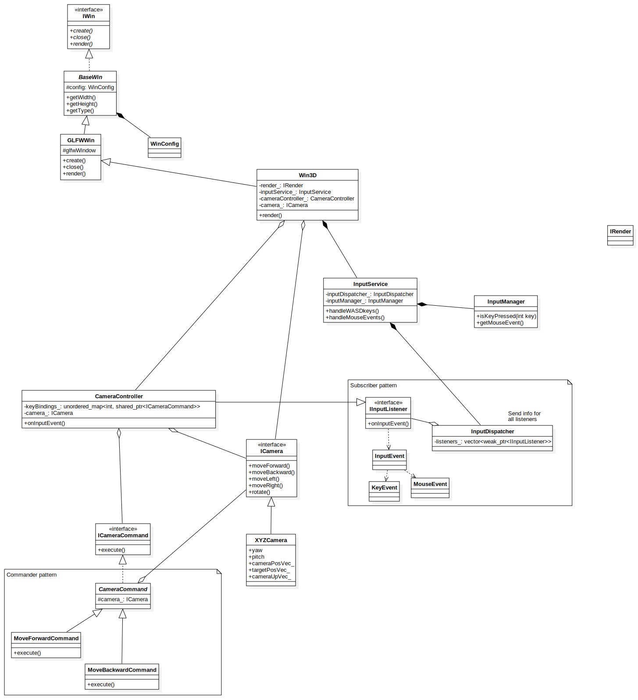

## GLAD Version
https://glad.dav1d.de/#language=c&specification=gl&api=gl%3D3.3&api=gles1%3Dnone&api=gles2%3Dnone&api=glsc2%3Dnone&profile=core&loader=on

Сборка 

```bash
g++ -std=c++20 main.cpp -I.  OGLWrap/glad/src/glad.c -IOGLWrap/glad/include -IOGLWrap/details -I../inc -IOGLWrap/glm -o out -lglfw -lGL -ldl

XDG_SESSION_TYPE=x11 GLFW_PLATFORM=x11 ./out
```


