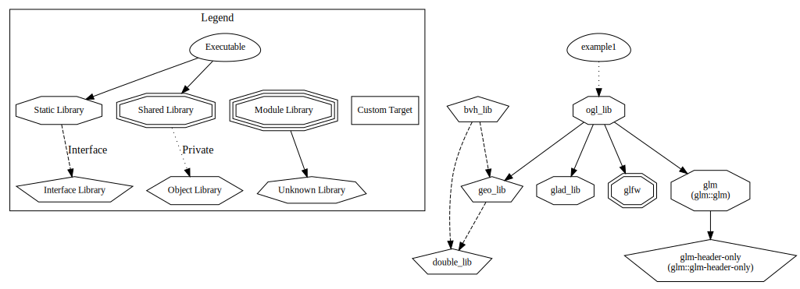

# **Triangles Rebellion**

## **Technology Stack**


---

## **Project Overview**

This project implements a C++ architecture utilizing SOLID principles and GoF design patterns (creational, structural, behavioral). It employs C++23 modules for code organization and CMake with Ninja generator for build automation. The system is structured as two independent libraries providing clear separation of concerns.


> ⚠️ **Attentions:** This repository contains submodules. Clone with the flag `--recursive`:
> ```bash
> git clone --recursive https://github.com/Matvey787/Triangles_Rebellion.git
> ```

---

## **Table of Contents**

1. [Geometry Library](#geometry-library)
   - [Overview](#overview-1)
   - [Examples](#examples-1)
   - [Source Code](#source-code-1)

2. [OpenGL Library](#opengl-library)
   - [Overview](#overview-2)
   - [Examples](#examples-2)
   - [Source Code](#source-code-2)

3. [Building Instructions](#building-instructions)

---

## **Geometry Library**

### Overview

The Geometry Library provides geometric primitives (points, vectors, lines, triangles) and spatial algorithms. All interfaces reside in the `GEO` namespace with the main header `geo.hpp`.

**Key Features:**
- Geometric primitives with template support
- Bounding Volume Hierarchy (BVH) acceleration structure
- Triangle intersection detection algorithms

**Example Usage:**
```cpp
#include "geo.hpp"

// Create geometric primitives
Geo::Point<float> p1(0.0f, 0.0f, 0.0f);
Geo::Point<float> p2(1.0f, 0.0f, 0.0f);
Geo::Point<float> p3(0.0f, 1.0f, 0.0f);
Geo::Triangle<float> triangle(p1, p2, p3);

// BVH intersection detection
BVH::BVH<double> bvh(triangles);
std::vector<size_t> candidates;
bvh.potentialOverlaps(i, candidates);
```

### Examples

Location: `examples/geo_lib/`

**Build and Run:**
```bash
cd examples/geo_lib
cmake -G=Ninja -S . -B build -DCMAKE_CXX_COMPILER=clang++
cmake --build build
./build/intersection
```

### Source Code

Location: `geo_lib/`

---

## **OpenGL Library**

### Overview

The OpenGL Library provides window management and OpenGL context abstraction using GLFW3. It handles window creation, OpenGL context management, and input processing.

**Architecture (uml diagram):**


**Cmake libraries dependency graph:**


### Examples

Location: `examples/ogl_lib/`

**Build and Run:**
```bash
cd examples/ogl_lib
cmake -G=Ninja -S . -B build -DCMAKE_CXX_COMPILER=clang++
cmake --build build
XDG_SESSION_TYPE=x11 GLFW_PLATFORM=x11 ./build/exe_you_want_to_run
```

### Source Code

Location: `ogl_lib/`

---

## **Building Instructions**

**Project Integration:**
```cmake
# Add libraries to your CMake project
add_subdirectory(path/to/geo_lib)
add_subdirectory(path/to/ogl_lib)

# Link against libraries
target_link_libraries(your_target PRIVATE geo_lib ogl_lib)
```

**Dependencies:**
- C++23 compatible compiler (Clang recommended)
- CMake 3.28 or higher
- GLFW3 (for OpenGL library)
- Google Test (optional, for testing)

**Repository:** https://github.com/Matvey787/Triangles_Rebellion
